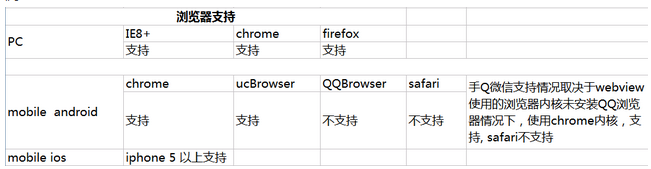
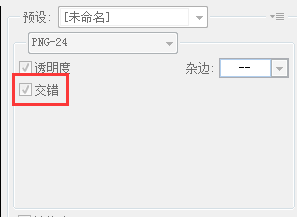

# 图片压缩和png格式图片浏览器的交错式渲染

@huanglijiao create

@2015-10-12

### 图片压缩 

* 1 使用gulp里的图片压缩模块

var imagemin = require('gulp-imagemin'); 

* 2 在gulpfile.js中添加task,任务名称为‘mini: image’,将workspace/assets/img下的图片处理后存在对应的output/assets/img目录下。

### png格式图片浏览器的交错式渲染：

> 浏览器支持情况：

> 在photoshop中的设置：

文件-&gt;存储为web所有格式...,然后在弹出对话框的右侧中勾选‘交错’，如下图所示：

> 测试

可以将图片提交到服务器上，更换网络来测。

> png格式的图片的渲染方式和jpeg的类似。

可参考文档：

http://www.alloyteam.com/2015/06/baselinejpegvs-progressivejpeg/

http://www.zhangxinxu.com/wordpress/2013/01/progressive-jpeg-image-and-so-on/

