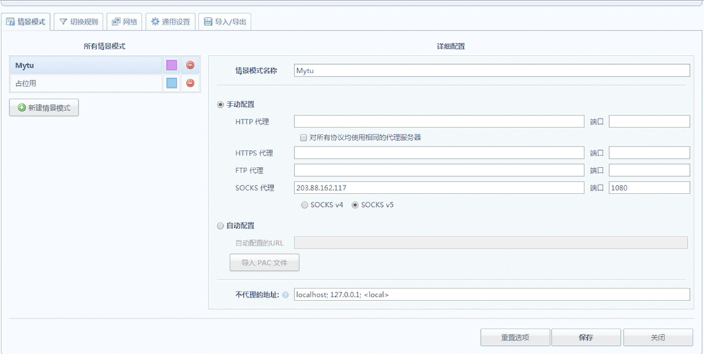
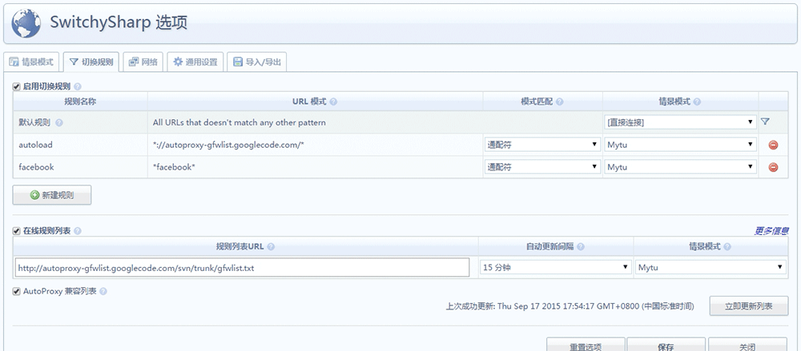
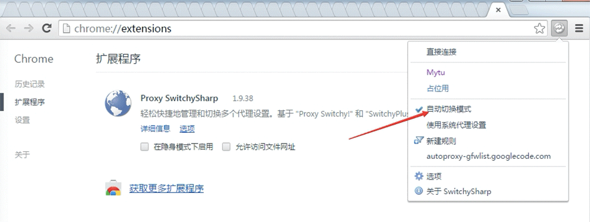

# 翻墙服务代理配置

<small>@天兴大人 2015-9</small>

> STEP 1 

使用Chrome浏览器、安装SwitchSharp插件。在Chome访问：chrome://extensions/ 。将邮件附件拖入浏览器。

> STEP 2

新建一个情景模式，默认的不知为何无法添加SOCKS代理

> STEP 3

在新建的情景模式中，添加SOCKS代理 IP:203.88.162.117  端口:1080

> STEP 4

选择SOCKS v5

> STEP 5

新建切换规则：

1. 将自动更新的境外站点获取地址添加入规则，名字随便起。并选择情景模式为之前建立的代理模式。  
*://autoproxy-gfwlist.googlecode.com/\*

2. 其他需访问网站可自定义。并选择情景模式为之前建立的代理模式。
*facebook\*

3. 勾选在线规则、URL地址为：http://autoproxy-gfwlist.googlecode.com/svn/trunk/gfwlist.txt 。并选择情景模式为之前建立的代理模式。调整更新时间。

4. 点击立即更新、失败了的话、多点几次。

> STEP 6

Chome窗口右上角选自动切换代理。访问facebook

> 配置

参照图片

下载switch sharp

[SwitchSharp](./img/Proxy_SwitchySharp.crx)

